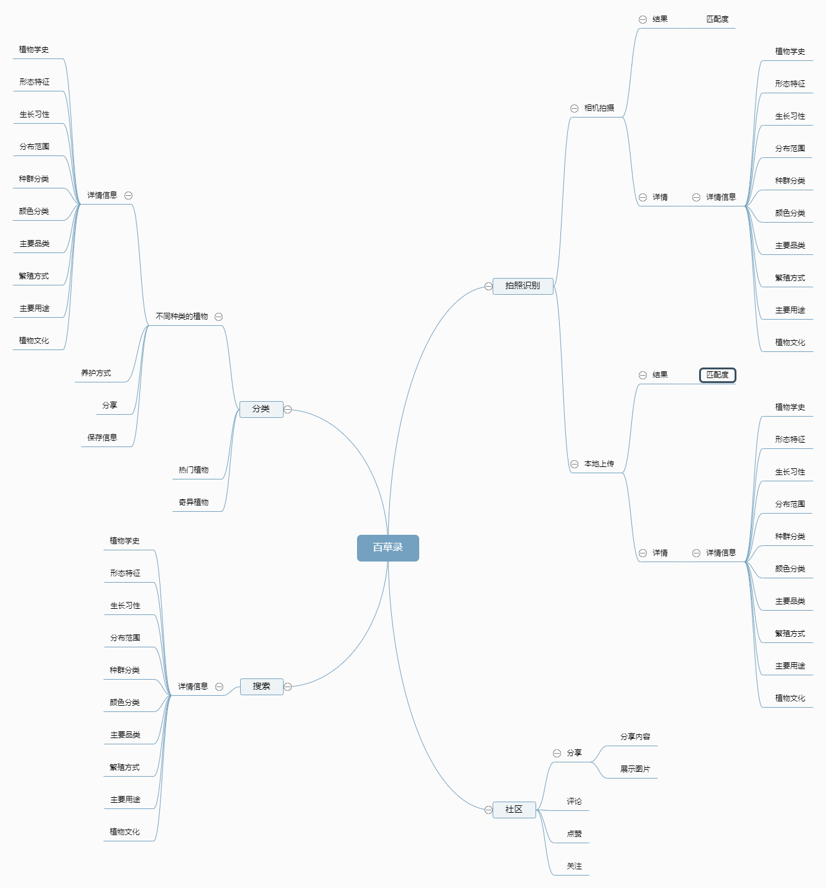

# 一. 项目名称：“百草录”小程序


| 文档名称：   | “百草录”小程序——产品需求文档                                 |
| ------------ | ------------------------------------------------------------ |
| 产品名称：   | 百草录                                                       |
| 产品描述：   | 一款利用人工智能技术快速识别植物的APP应用，为用户搭建了一个基于植物知识进行学习和交友的社交平台 |
| 产品版本：   | 1.1.2                                                        |
| 文件拥有者： | 曾子毅 2010130057                                            |

# 二. 价值主张设计

------

## 1.加值宣言

随着人们生活水平的提高，越来越多的人群想要为增添生活中的色彩及优化生活质量，研究植物知识、养花种草也成为人们的一种消遣方式。同时，人们对于植物种类的确定和相关知识的需求也越来越多，通过图书比对，图片比对这些传统的方式在互联网的时代无法满足人们对于获悉知识效率的追求，本产品利用百度ai平台精准的“植物识别”API进行整合和优化，直击用户痛点，帮助用户了解植物知识，融入植物学社区，结交志同道合的人。

## 2.核心价值

####  任务点/痛点（问题）：

1. 想知道是什么植物：走在路上看到不认识的植物想知道名字、家长面对孩子关于植物的询问不知道怎么回答
2. 想了解关于植物的更多知识：家里买了新的植物不知道怎么养护、某种植物能不能吃有什么效用、学生为了完成老师布置的植物相关作业、园林从业者积累自己的工作知识
3. 想展示自己在植物方面的知识积累：帮忙鉴定植物解答疑问、发表优质植物科普类文章
4. 想与志同道合的人交流关于植物的心得：讨论自己喜欢的植物、分享自己养花的经验

#### 最小可行性产品（解决方案）：

利用红酒识别的功能，为植物研究者和爱好者提供一个社区分享的平台，通过拍照识别，了解植物知识，通过在社群中的交流和信息交换，培养植物研究的兴趣并结交更多的爱好者。

## 3.价值主张画布：

| 关键伙伴                   | 关键业务       | 价值主张                                                     | 客户细分                                                     |
| -------------------------- | -------------- | ------------------------------------------------------------ | ------------------------------------------------------------ |
| 植物学专家、植物学研究者、 | 拍照识别植物、 | 利用百度ai平台精准的“植物识别”API进行整合和优化，直击用户痛点，帮助用户了解植物知识，融入植物学社区 | 植物学专家、植物学研究者、相关专业的教师和学生、业余植物爱好者以及想认识植物、了解植物的用户 |
| **成本结构**               | **收入来源**   | 核心资源                                                     | 客户关系                                                     |
| 小程序开发与日常运营成本   | 第三方广告植入 | 百度ai开放平台带来的api接口调用，百度数据库中丰富的知识资源  | 通过平台与客户以及客户与客户之间以社群方式构建弱联系         |

# 三. 需求概述

------

## 1.用户分析

目标用户涵盖了植物学专家、植物学研究者、相关专业的教师和学生、业余植物爱好者以及想认识植物、了解植物的用户。

## 2.需求列表

| 用户场景                                                     | 用户需求                       | api类型                     | 优先级 |
| ------------------------------------------------------------ | ------------------------------ | --------------------------- | ------ |
| 小a是个非植物专业的学生，在路上看到一种花，为满足好奇心他希望得到这种花的全部信息 | 1秒就能知道植物的名字和故事    | 百度ai平台中的“植物识别api” | t0     |
| 小b是个植物学研究者，他希望在互联网上能找到志同道合的人互相交流，一起进步 | 加入植物领域的社群             | /                           | t1     |
| 小a是个植物爱好者，他收藏了一些植物的标本，希望能在互联网上进行分享 | 展示自身，寻找相同爱好者的平台 | /                           | t1     |
| 小a想了解关于植物的更多知识：家里买了新的植物不知道怎么养护、某种植物能不能吃有什么效用 | 快速识别出植物的有关信息       | 百度ai平台中“植物识别api”   | t0     |

## 3. SWOT分析

- Strength：在能快速识别植物的基础功能上，还包含鉴定、分享、社交等多功能，能满足用户多种需求，界面相较竞品更为美观舒适符合产品定位，不仅有科普性知识还有极具文艺性的诗词赏花，内容优质，几乎没有商业广告植入，已经积累一定量的用户，建立了良好口碑。

- Weakness：识别结果准确率和速度不能使用户完全满意，隐私权限设置让用户不满意，社交平台属性不明显，大部分用户仍然即用即走，停留时间短，商业变现方式太少。

- Opportunity：找准了用户人群与痛点，市场需求大，越来越多的人想了解学习植物相关的知识，存有大量潜在用户。

- Threat：类似竞品较多，用户在社区中参与感低的劣势。

## 4.DFV模型

**1.产品市场（技术可行性 Feasibility）**

​	目前植物识别产品的市场仍然处于发展初期的阶段，目前没人任何一款或几款产品在市场上完成垄断。市面上已有的一些app对于识别信息的精准度和详细度无法满足所有用户的需求。且在于小程序产品上，已有的产品并不多。大部分的业余爱好者或普通用户不愿花费手机流量或内存去下载app产品，他们更倾心于使用小程序，因此该产品有很大的发展空间。

**2.市场概述(用户可欲性Desirability)**

- 市场概述：随着人们生活水平的提高，越来越多的人群想要为增添生活中的色彩及优化生活质量，研究植物知识、养花种草也成为人们的一种消遣方式。植物识别产品应运而生，这些产品对于培养植物研究的良好社会氛围，培养植物爱好者社群起着重要作用。

- 市场特征：

  -- 研究植物逐渐成为人们的爱好，更多的学者选择了植物学进行研究，他们对于方便的互联网工具有着巨大的需求
  -- 植物培育逐渐成为人们的爱好，随着生活质量的整体提高，越来越多的人种花养草，他们对于植物养护的知识获取有着非常浓厚的兴趣


**3.产品优势（商业可行性 Viability）**

- 识别植物：通过拍照是被植物，提供丰富完整的识别结果信息，小程序中有着基于百度数据库的海量植物信息，提供准确完整的识别结果

- 植物知识学习：小程序内置基于百度词条和百度百科的大量知识信息，通过归类整理后，用户可以选择性地获取到他们想要的植物知识

  

# 四. 界面结构

------

- 以下为本产品的结构图，里面对本产品的详细功能进行了描述




#  五、产品设计原型图

------
- 以下为本产品的原型图


#  

#  六、API 产品使用及输出展示

------

## 植物识别API调用简介

**接口来源：百度AI开放平台**

百度API是百度平台对外开放的一系列应用程序接口。开发人员能够调用API与搜索平台直接交互，基于API开发自己的应用程序。目前百度开放的API涵盖了图像技术、语音技术、文字识别、人脸与人体识别，AR与VR，自然语言处理、知识图谱等接口，并且有些接口是可以免费使用的。

**APIkey&Secretkey**


**接口描述**

​	该请求用于识别一张图片，即对于输入的一张图片（可正常解码，且长宽比较合适），输出植物识别结果。

**在线调试**

​	可以在 [API Explorer](https://cloud.baidu.com/apiexplorer/index.html?Product=GWSE-wpnv4rj4dDD&Api=GWAI-QG5fDSmupPh) 中调试该接口，可进行签名验证、查看在线调用的请求内容和返回结果、示例代码的自动生成。

**请求说明**

HTTP 方法：`POST`

请求URL： `https://aip.baidubce.com/rest/2.0/image-classify/v1/plant`

URL参数：

| 参数          | 值                                                           |
| ------------- | ------------------------------------------------------------ |
| access_tokena | 通过API Key和Secret Key获取的access_token,参考“[Access Token获取](http://ai.baidu.com/docs#/Auth)” |

Header如下：

| 参数         | 值                                |
| ------------ | --------------------------------- |
| Content-Type | application/x-www-form-urlencoded |

Body中放置请求参数，参数详情如下：

请求参数：

| 参数名称  | 是否必选      | 类型    | 说明                                                         |      |
| --------- | ------------- | ------- | ------------------------------------------------------------ | ---- |
| image     | 和url二选一   | string  | 图像数据，base64编码，要求base64编码后大小不超过4M，最短边至少15px，最长边最大4096px,支持jpg/png/bmp格式。**注意：图片需要base64编码、去掉编码头后再进行urlencode。** |      |
| url       | 和image二选一 | string  | 图片完整URL，URL长度不超过1024字节，URL对应的图片base64编码后大小不超过4M，最短边至少15px，最长边最大4096px,支持jpg/png/bmp格式，当image字段存在时url字段失效。 |      |
| baike_num | 否            | integer | 用于控制返回结果是否带有百科信息，若不输入此参数，则默认不返回百科结果；若输入此参数，会根据输入的整数返回相应个数的百科信息 |      |

**价格介绍：植物识别**


## 代码实验

**1.获取access_token**


**2.调用植物识别代码**

​	 **选择实验图片**


​	**调用代码页面**
	

  **输出结果**


​	**代码源展示**	

```python
## 
# encoding:utf-8

import requests
import base64

'''
植物识别
'''

request_url = "https://aip.baidubce.com/rest/2.0/image-classify/v1/plant"
# 二进制方式打开图片文件
f = open('yuanweihua.jpg', 'rb')
img = base64.b64encode(f.read())

payload={
    'access_token':'24.f5701fd8c3bdfef7c58d16fff0e8b8e2.2592000.1658743582.282335-25863377',
    'image':img,
    'baike_num':5,
    "top_num":5
}


headers = {'content-type': 'application/x-www-form-urlencoded'}
response = requests.post(request_url, data=payload, headers=headers)
if response:
    print (response.json())
```

​	**通用代码**

```python

# encoding:utf-8

import requests
import base64

'''
植物识别
'''

request_url = "https://aip.baidubce.com/rest/2.0/image-classify/v1/plant"
# 二进制方式打开图片文件
f = open('[本地文件]', 'rb')
img = base64.b64encode(f.read())

params = {"image":img}
access_token = '[调用鉴权接口获取的token]'
request_url = request_url + "?access_token=" + access_token
headers = {'content-type': 'application/x-www-form-urlencoded'}
response = requests.post(request_url, data=params, headers=headers)
if response:
    print (response.json())
```

**3.返回结果**

返回参数

| 参数          | 类型          | 是否必须 | 说明                         |
| ------------- | ------------- | -------- | ---------------------------- |
| log_id        | uint64        | 是       | 唯一的log id，用于问题定位   |
| result        | arrry(object) | 是       | 植物识别结果数组             |
| +name         | string        | 是       | 植物名称，示例：吉娃莲       |
| +score        | uint32        | 是       | 置信度，示例：0.5321         |
| +baike_info   | object        | 否       | 对应识别结果的百科词条名称   |
| ++baike_url   | string        | 否       | 对应识别结果百度百科页面链接 |
| ++image_url   | string        | 否       | 对应识别结果百科图片链接     |
| ++description | string        | 否       | 对应识别结果百科内容描述     |

返回示例

```python
HTTP/1.1 200 OK
x-bce-request-id: 73c4e74c-3101-4a00-bf44-fe246959c05e
Cache-Control: no-cache
Server: BWS
Date: Tue, 18 Oct 2016 02:21:01 GMT
Content-Type: application/json;charset=UTF-8
{
	"log_id": 1705495792822072357,
	"result": [{
		"score": 0.99979120492935,
		"name": "莲",
		"baike_info": {
			"baike_url": "http://baike.baidu.com/item/%E8%8E%B2/2717141",
			"description": "莲(Nelumbo nucifera)，又称荷、荷花、莲花、芙蕖、鞭蓉、水芙蓉、水芝、水芸、水旦、水华等，溪客、玉环是其雅称，未开的花蕾称菡萏，已开的花朵称鞭蕖，莲科，属多年生水生宿根草本植物，其地下茎称藕，能食用，叶入药，莲子为上乘补品，花可供观赏。是我国十大名花之一。是印度的国花。莲，双子叶植物，睡莲科。多年生挺水草本植物。根状茎横走，粗而肥厚，节间膨大，内有纵横通气孔道，节部缢缩。叶基生，挺出水面，盾形，直径30-90cm，波状边缘，上面深绿色，下面浅绿色。叶柄有小刺，长1-2m，挺出水面。花单生，直径10-25cm，椭圆花瓣多数，白色或粉红色；花柄长1-2m。花托在果期膨大，直径5-10cm，海绵质。坚果椭圆形和卵圆形，长1.5-2.0cm，灰褐色。种子卵圆形，长1.2-1.7cm，种皮红棕色。生于池塘、浅湖泊及稻田中。中国南北各省有自生或栽培，经济价值高。人们习惯上称种子为“莲子”、地下茎为“藕”、花托为“莲蓬”、叶为“荷叶”。"
		}
	},
	{
		"score": 0.00015144718054216,
		"name": "红睡莲"
	},
	{
		"score": 1.2172759852547e-05,
		"name": "白睡莲"
	},
	{
		"score": 6.305016540864e-06,
		"name": "延药睡莲"
	},
	{
		"score": 3.6133328649157e-06,
		"name": "华夏慈姑"
	}]
}

```

返回结果

```python
{'result': [{'score': 0.7598952, 'name': '玉蝉花', 'baike_info': {'baike_url': 'http://baike.baidu.com/item/%E7%8E%89%E8%9D%89%E8%8A%B1/2221688', 'image_url': 'https://bkimg.cdn.bcebos.com/pic/3bf33a87e950352a103995775743fbf2b2118b71', 'description': '玉蝉花(Iris ensata Thunb.)：多年生草本，植株基部围有叶鞘残留的纤维。根状茎粗壮，斜伸，外包有棕褐色叶鞘残留的纤维；须根绳索状，灰白色，有皱缩的横纹。叶条形，两面中脉明显。花茎圆柱形，实心，有1-3枚茎生叶；苞片3枚，近革质，披针形，内包含有2朵花；花深紫色，直径9-10厘米；外花被裂片倒卵形，内花被裂片小，直立，狭披针形或宽条形。蒴果长椭圆形，顶端有短喙，6条肋明显，成熟时自顶端向下开裂至1/3处；种子棕褐色，扁平，半圆形，边缘呈翅状。花期6-7月，果期8-9月。生于沼泽地或河岸的水湿地。产中国黑龙江、吉林、辽宁、山东、浙江，也产于朝鲜、日本及苏联。此花有栽培，具有较高的园艺价值。(概述图片参考资料来源：)'}}, {'score': 0.33954698, 'name': '鸢尾', 'baike_info': {'baike_url': 'http://baike.baidu.com/item/%E9%B8%A2%E5%B0%BE/784374', 'image_url': 'https://bkimg.cdn.bcebos.com/pic/5fdf8db1cb1349542259b6915c4e9258d0094afb', 'description': '鸢尾(学名：Iris tectorum Maxim.)又名：蓝蝴蝶、紫蝴蝶、扁竹花等，属百合目、鸢尾科、鸢尾属多年生草本，根状茎粗壮，直径约1cm，斜伸；叶长15~50cm，宽1.5~3.5cm，花蓝紫色，直径约10cm；蒴果长椭圆形或倒卵形，长4.5~6cm，直径2~2.5cm。原产于中国中部以及日本，主要分布在中国中南部。可供观赏，花香气淡雅，可以调制香水，其根状茎可作中药，全年可采，具有消炎作用。'}}, {'score': 0.06559799, 'name': '矮鸢尾', 'baike_info': {'baike_url': 'http://baike.baidu.com/item/%E7%9F%AE%E9%B8%A2%E5%B0%BE/551629', 'image_url': 'https://bkimg.cdn.bcebos.com/pic/5d6034a85edf8db162c8a12e0423dd54574e7492', 'description': '矮鸢尾(学名：Iris kobayashii)是属于鸢尾科鸢尾属的一种植物。是中国的特有植物。矮生草本，高约10厘米。茎极短，为叶片所包裹。叶剑形，长7~12厘米，宽6~10米。花葶从叶丛中伸出，着花1朵，花色繁多，有黄白、紫等色。花期4~5月。分布于中国大陆的辽宁等地，见于干燥的丘陵地，尚未由人工引种栽培。'}}, {'score': 0.060905267, 'name': '德国鸢尾', 'baike_info': {'baike_url': 'http://baike.baidu.com/item/%E5%BE%B7%E5%9B%BD%E9%B8%A2%E5%B0%BE/1193911', 'image_url': 'https://bkimg.cdn.bcebos.com/pic/a044ad345982b2b733f684a735adcbef76099b6c', 'description': '德国鸢尾(学名：Iris germanica L.)是鸢尾科鸢尾属植物，多年生草本。根状茎粗壮而肥厚，常分枝，扁圆形，斜伸，具环纹，黄褐色；须根肉质，黄白色。叶直立或略弯曲，淡绿色、灰绿色或深绿色，常具白粉，剑形。花茎光滑，黄绿色。花大，鲜艳，直径可达12厘米；花色因栽培品种而异，多为淡紫色、蓝紫色、深紫色或白色，有香味。蒴果三棱状圆柱形，顶端钝，无喙，成熟时自顶端向下开裂为三瓣；种子梨形，黄棕色，表面有皱纹，顶端生有黄白色的附属物。花期4-5月，果期6-8月。原产于欧洲中部和南部。中国各地庭园常见栽培。对土壤要求不严，抗旱、抗寒能力强。喜温暖、稍湿润和阳光充足环境。耐寒，耐干燥和半阴，怕积水。宜疏松、肥沃和排水良好的含石灰质土壤。德国鸢尾耐寒性强，生长健壮，有深紫、纯白、桃红、淡紫等颜色，是极好的观花地被植物，在园林绿化中常用于花坛、花境布置。同时，可盆栽观赏，也是重要的切花材料。(概述图参考来源：)'}}, {'score': 0.053501323, 'name': '花菖蒲', 'baike_info': {}}], 'log_id': 1540653926854896381}
```


#  七、学习/实践心得总结及感谢

------

1. **学习心得：**

   ​	通过本学期课程《API、机器学习与人工智能》的学习，我对于API_AI_ML的知识有了系统性的了解，培养了代码思维和学习能力，了解到了世界前沿的互联网知识，对于未来的互联网智能世界有了独立的思考。

   ​	完成一个基于识别功能的互联网产品构思是一个漫长的，系统性思考与探究的过程。在确立构思的初期，面对纷繁的api接口和功能，我在选择上陷入了困境。我能做什么，我需要做什么这是在前期最需要决定的问题。在构思的过程中我对于日常事物和需求进行了长时间的观察，终于在一次对于植物的拍摄时找到了灵感（以下放上几张给予我灵感启发的照片）。通过智能的互联网产品获取知识是人们迫切需要且追求的，它拥有着独立而永恒的价值。

   

   

   

   

   ​	确立了目标之后我，开始了对于相关api接口的寻找和选择，最终选择了百度智能平台的api。在进行了api接口的调用和实验之后，我通过书写该文档，对产品原型的制作，用户交互，对于用户流程、界面流程有了清晰的了解。通过书写PRD文档，对价值主张画布、用户需求、数据流程图有了系统的梳理，在思维能力上也。

   1. **感谢：**

      ​	感谢[百度智能云](https://gitee.com/link?target=https%3A%2F%2Fcloud.baidu.com)API平台，提供了API产品与免费的API调用额度，让我有机会完成该产品与学习智能API的相关知识。

      ​    感谢许智超老师的课堂讲解以及整洁的学习文档（https://gitee.com/xzhichao/api_ai_ml?_from=gitee_search）对我在于API_AI_ML学习上的启蒙和引领。

      ​	感谢简书作者[tessssstao](https://www.jianshu.com/u/3bea198a95c5)对于形色app的产品分析报告为我产品的规划带来了启发，感谢网络上的开源代码帮我解决了进行api实验时产生的问题。

      ​    感谢梁善宜学姐的prd文档（https://gitee.com/LiangShanYi/API/blob/master/README.md）为我规划和书写需求文档提供了参考。

​			


